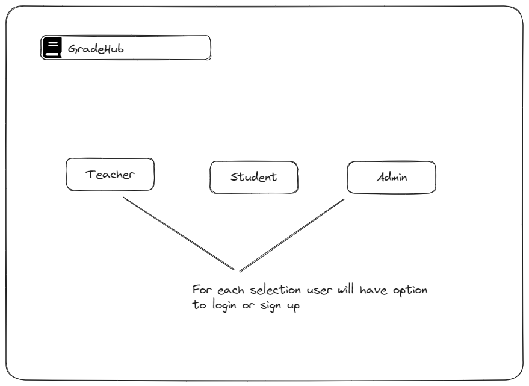
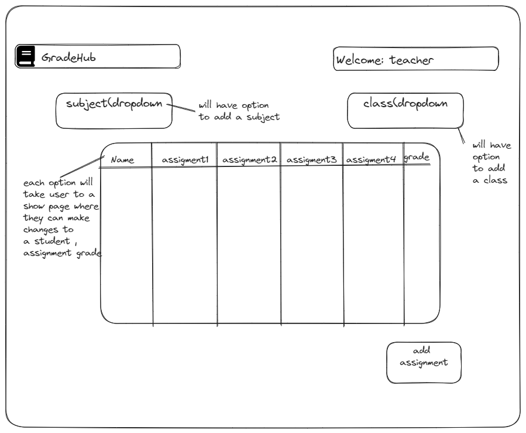
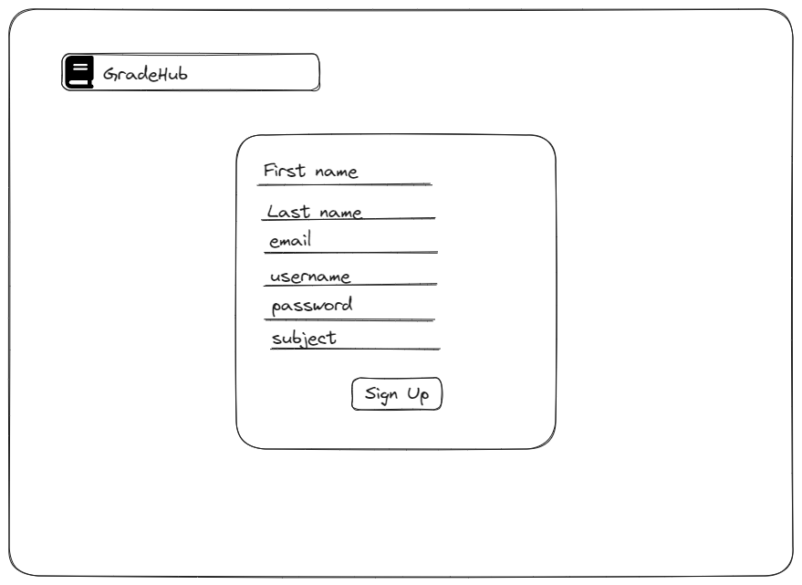
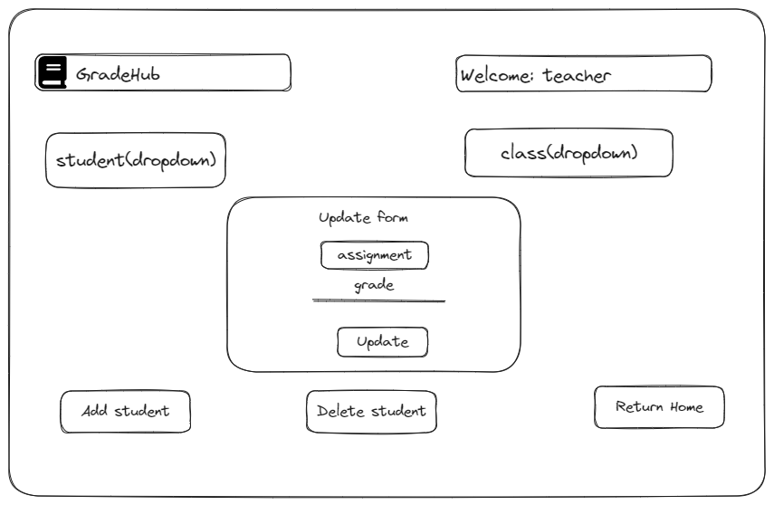
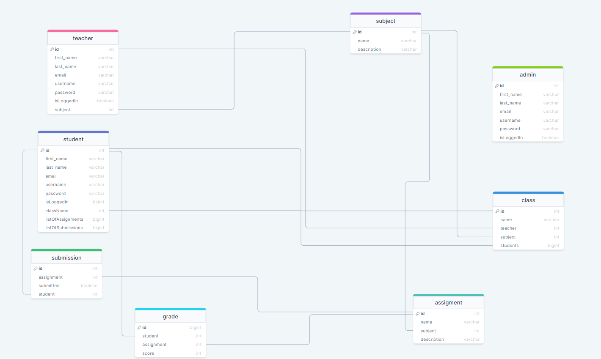

<h1>GradeHub : GradeBook API</h1>
<h2>Prerequisites</h2>

Before running this project, ensure that you have the following installed:

<ul>
<li><a href="https://nodejs.org">Node.js</a>: Make sure you have Node.js installed on your machine.</li>
</ul>

Also have Nodemon installed globally. To install, you can follow these steps:

<ol><li>Open your command prompt or terminal</li>
   <li>Runthe following command to install Nodemon globally using npm</li>
</ol>
   <pre><code>npm install -g nodemon</code></pre>

If you are using a Unix-based system (e.g., macOS, Linux), you might need to use <code>sudo</code>:

  <pre><code>sudo npm install -g nodemon</code></pre>

<h2>Getting Started</h2>
   <ol>
    <li>Clone this repository.</li>
    <li>Install project dependencies by running <code>npm install</code>.</li>
    <li>Create an `.env` file in the root directory of the project.</li>
    <li>In the `.env` file, define the following variables:</li>
  </ol>

  <pre><code>
    MONGO_URI=mongodb://your-mongodb-uri
    SECRET=your-secret-key
  </code></pre>

  
Replace <code>mongodb://your-mongodb-uri</code> with your actual MongoDB connection URI, and <code>your-secret-key</code> with your desired secret key for authentication.

  <h2>Running the Project</h2>
  
To start the projec with dev mode , run the following command:

  <pre><code>npm run dev</code></pre>

   
To start the projec without dev mode , run the following command:

  <pre><code>npm start</code></pre>

  
The application should now be running on <code>http://localhost:3000</code>.

<h2>API Requests in Postman</h2>

To make an API request using Postman:

<ol>
  <li>Open Postman and make sure your server is running locally on <code>http://localhost:3000</code>.</li>
  <li>Select the HTTP method as <strong>POST</strong>.</li>
  <li>Enter the request URL as <code>http://localhost:3000/teachers</code>.</li>
  <li>Set the request headers:</li>
</ol>
<pre><code>
Content-Type: application/json
</code></pre>

In the request body, select the <strong>raw</strong> option and choose <strong>JSON</strong> from the dropdown.

Enter the following JSON object as the request body:

<pre><code>{
  "first_name": "arthur",
  "last_name": "bernier",
  "email": "arthurb@gmail.com",
  "username": "arthurb",
  "password": "test123",
  "subject": "SEI"
}</code></pre>

Click the <strong>Send</strong> button to submit the request.

<h2>Running Tests</h2>

To run the tests:

<ol>
  <li>Ensure the app is not running.</li>
  <li>Execute the following command:</li>
</ol>

<pre><code>npm test</code></pre>

<h2>Running Load Tests</h2>

To run load tests:

<ol>
  <li>Ensure the app is running.</li>
  <li>Execute the following command:</li>
</ol>

<pre><code>npm run load</code></pre>

<h2>Wireframes</h2>

Below are wireframes for the project:

<h3>Wireframe 1</h3>
  

  <h3>Wireframe 2</h3>
  

  <h3>Wireframe 3</h3>
  

  <h3>Wireframe 4</h3>
  

  <h3>ERD Diagram</h3>
  

  
For more detailed wireframes and project planning, please refer to my <a href="https://trello.com/b/SDgT0nLh/grade-book-api">Trello board</a>.

